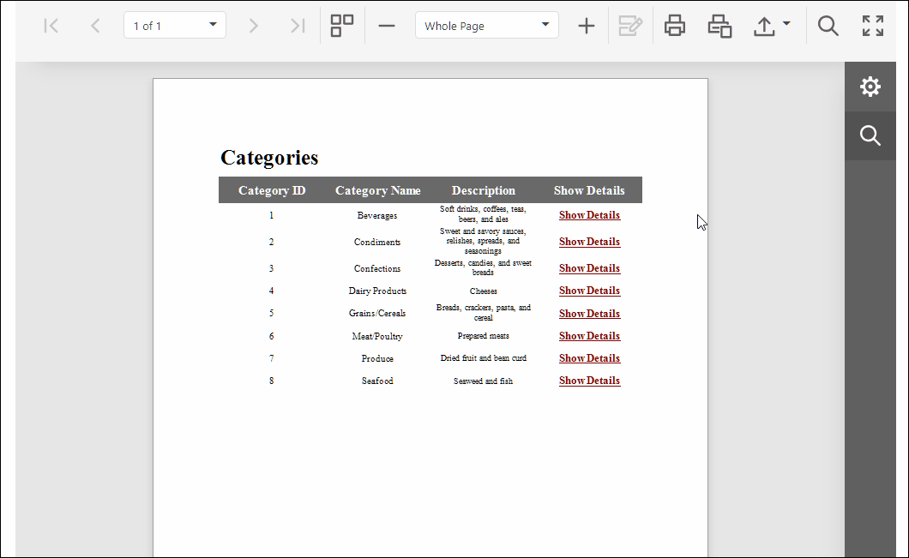

<!-- default badges list -->

[](https://supportcenter.devexpress.com/ticket/details/T483368)
[](https://docs.devexpress.com/GeneralInformation/403183)
[](#does-this-example-address-your-development-requirementsobjectives)
<!-- default badges end -->
# Reporting for ASP.NET Core - How to Create Drill-through Report

## Overview 

This example shows how to implement `drill-through reports`. Drill-through reports allow users to click a report element (text or image) and open another report using the same [Viewer](https://docs.devexpress.com/XtraReports/400248/web-reporting/asp-net-core-reporting/document-viewer). 

In this example, the user clicks the "Show Details" label in the main report, and the [Web Document Viewer](https://docs.devexpress.com/XtraReports/400248/web-reporting/asp-net-core-reporting/document-viewer) displays the detailed report associated with the clicked item. The detailed report contains **Back** button (an [XRPictureBox](https://docs.devexpress.com/XtraReports/DevExpress.XtraReports.UI.XRPictureBox) control in this example) that allows the user to return to the main report.



## Implementation Details 

A mouse click in a report triggers the [PreviewClick](https://docs.devexpress.com/XtraReports/DevExpress.AspNetCore.Reporting.WebDocumentViewer.WebDocumentViewerClientSideEventsBuilder.PreviewClick(System.String)) event on the client side. This event handler should retrieve information about the clicked item and pass it to the `drillThrough' method of the report preview. This client method accesses the [IDrillThroughProcessorAsync](https://docs.devexpress.com/XtraReports/DevExpress.XtraReports.Web.WebDocumentViewer.IDrillThroughProcessorAsync) server service and calls its [CreateReportAsync](https://docs.devexpress.com/XtraReports/DevExpress.XtraReports.Web.WebDocumentViewer.IDrillThroughProcessorAsync.CreateReportAsync(DevExpress.XtraReports.Web.WebDocumentViewer.DrillThroughContext)) method. 

The [CreateReportAsync](https://docs.devexpress.com/XtraReports/DevExpress.XtraReports.Web.WebDocumentViewer.IDrillThroughProcessorAsync.CreateReportAsync(DevExpress.XtraReports.Web.WebDocumentViewer.DrillThroughContext)) method takes a [DrillThroughContext](https://docs.devexpress.com/XtraReports/DevExpress.XtraReports.Web.WebDocumentViewer.DrillThroughContext) object as an argument. Its [DrillThroughContext.CustomData](https://docs.devexpress.com/XtraReports/DevExpress.XtraReports.Web.WebDocumentViewer.DrillThroughContext.CustomData) property contains the information previously passed in the `PreviewClick' event handler. 

Process this information and define a report to open. To request the report asynchronously, call the [IReportProviderAsync.GetReportAsync](https://docs.devexpress.com/XtraReports/DevExpress.XtraReports.Services.IReportProviderAsync) method. 

At this point you can configure the report before passing it to the viewer - specify [Report Parameters](https://docs.devexpress.com/XtraReports/4812/detailed-guide-to-devexpress-reporting/shape-report-data/use-report-parameters) or configure the report parameters. 

### Report  

Assign the string "details" (in the main report) or "back" (in the detail report) to the [NavigateUrl](https://docs.devexpress.com/XtraReports/DevExpress.XtraReports.UI.XRControl.NavigateUrl) property of the report control to create a link and specify a navigation path. To specify a master value, bind the `Tag` property to the master report's ID field.
The master value is used to filter a detailed report at the data source level. 

### Client 

A click in a report triggers the [PreviewClick](https://docs.devexpress.com/XtraReports/DevExpress.AspNetCore.Reporting.WebDocumentViewer.WebDocumentViewerClientSideEventsBuilder.PreviewClick(System.String)) event on the client side. In the event handler, get the value of the [NavigateUrl](https://docs.devexpress.com/XtraReports/DevExpress.XtraReports.UI.XRControl.NavigateUrl) property from the `Brick.navigation.url` property.
Use the [GetBrickValue](https://docs.devexpress.com/XtraReports/js-ASPxClientPreviewClickEventArgs#js_aspxclientpreviewclickeventargs_getbrickvalue) method to get the value of the `Tag` property of the report control. 
The data is serialized into JSON. The `drillThrough` method of the client-side report preview sends it to the server.

The following code is the `PreviewClick` event handler function: 

```
function previewClick(s, e) {
        var brick = e.Brick;
        var navigationUrl = brick && brick.navigation && brick.navigation.url;
        if(navigationUrl && ["back", "details"].indexOf(navigationUrl) >= 0) {
            var reportPreview = s.GetReportPreview();
            var navigateInfo = {
                NavigateTo: navigationUrl,
                MasterID: e.GetBrickValue(),
            };
            reportPreview.drillThrough(JSON.stringify(navigateInfo));
            e.Handled = true;
        }
}
```

### Server 

The `CustomDrillThroughProcessorAsync` class implements the [IDrillThroughProcessorAsync](https://docs.devexpress.com/XtraReports/DevExpress.XtraReports.Web.WebDocumentViewer.IDrillThroughProcessorAsync) interface. Its [CreateReportAsync](https://docs.devexpress.com/XtraReports/DevExpress.XtraReports.Web.WebDocumentViewer.IDrillThroughProcessorAsync.CreateReportAsync(DevExpress.XtraReports.Web.WebDocumentViewer.DrillThroughContext)) method takes a [DrillThroughContext](https://docs.devexpress.com/XtraReports/DevExpress.XtraReports.Web.WebDocumentViewer.DrillThroughContext) object as an argument.

The [CustomData](https://docs.devexpress.com/XtraReports/DevExpress.XtraReports.Web.WebDocumentViewer.DrillThroughContext.CustomData) property contains data passed from the `PreviewClick` event on the client side. 

Use this data to define the report to open. You must call the [GetReportAsync](https://docs.devexpress.com/XtraReports/DevExpress.XtraReports.Services.IReportProviderAsync) method of the `CustomReportProviderAsync' service (a service that implements the [IReportProviderAsync](https://docs.devexpress.com/XtraReports/DevExpress.XtraReports.Services.IReportProviderAsync) interface) to request the report asynchronously. The custom method implementation allows you to specify [Report Parameters](https://docs.devexpress.com/XtraReports/4812/detailed-guide-to-devexpress-reporting/shape-report-data/use-report-parameters):
 

```csharp
  public class NavigateInfo {
        public string NavigateTo { get; set; }
        public string MasterID { get; set; }
    }
    public class CustomDrillThroughProcessorAsync : IDrillThroughProcessorAsync {
        readonly IReportProviderAsync reportProviderAsync;

        public CustomDrillThroughProcessorAsync(IReportProviderAsync reportProviderAsync) {
            this.reportProviderAsync = reportProviderAsync;
        }
        public async Task<DrillThroughResult> CreateReportAsync(DrillThroughContext context) {
            NavigateInfo navigateInfo = JsonSerializer.Deserialize<NavigateInfo>(context.CustomData);
            var reportToOpen = navigateInfo.NavigateTo == "back" ? "MainReport"
                : navigateInfo.NavigateTo == "details" ? "DetailReport1" : null;
            var report = await reportProviderAsync.GetReportAsync(reportToOpen, null) ?? context.Report;

            if(navigateInfo.NavigateTo == "details") {
                int catID = 0;
                Int32.TryParse(navigateInfo.MasterID, out catID);
                report.Parameters["categoryID"].Value = catID;
            }
            return new DrillThroughResult(report);
        }
}
```
At application startup, register the `CustomDrillThroughProcessorAsync` and `CustomReportProviderAsync` services and call the [ReportingConfigurationBuilder.UseAsyncEngine](https://docs.devexpress.com/XtraReports/DevExpress.XtraReports.Web.WebDocumentViewer.DefaultWebDocumentViewerContainer.UseAsyncEngine?f=export) method to enable asynchronous mode:

```csharp
using Microsoft.Extensions.DependencyInjection;
using DevExpress.XtraReports.Services;

  public class Startup {
  // ...
      public void ConfigureServices(IServiceCollection services) {          
          // ...
          services.ConfigureReportingServices(configurator => {
              // ...
              configurator.UseAsyncEngine();
          });
          // ...
          services.AddScoped<IReportProviderAsync, CustomReportProviderAsync>();
          services.AddScoped<IDrillThroughProcessorAsync, CustomDrillThroughProcessorAsync>();
      }
      // ...
  }
```

## Files to  Review

- [Index.cshtml](Views/Home/Index.cshtml) 
- [CustomDrillThroughProcessorAsync.cs](Services/CustomDrillThroughProcessorAsync.cs)
- [CustomReportProviderAsync.cs](Services/CustomReportProviderAsync.cs)
- [Startup.cs](Startup.cs)
## Documentation

* [Create Drill-Through Reports](https://docs.devexpress.com/XtraReports/4789/detailed-guide-to-devexpress-reporting/provide-interactivity/create-drill-through-reports)
* [How to Use the Asynchronous Engine for Web Reporting](https://github.com/DevExpress-Examples/Reporting-Use-Async-Engine-In-AspNet-Core)

## More Examples

- [Reporting for WinForms - How to Create Drill-through Report](https://github.com/DevExpress-Examples/reporting-winforms-drill-through)
- [Reporting for WPF - How to Create Drill-through Report](https://github.com/DevExpress-Examples/reporting-wpf-drill-through)
<!-- feedback -->
## Does this example address your development requirements/objectives?

[](https://www.devexpress.com/support/examples/survey.xml?utm_source=github&utm_campaign=reporting-asp-net-core-drill-through&~~~was_helpful=yes) [](https://www.devexpress.com/support/examples/survey.xml?utm_source=github&utm_campaign=reporting-asp-net-core-drill-through&~~~was_helpful=no)

(you will be redirected to DevExpress.com to submit your response)
<!-- feedback end -->
